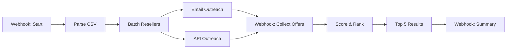

# Disposable Marketplace

[](https://github.com/jeremy-longshore/disposable-marketplace-n8n/actions/workflows/ci.yml)
[](https://opensource.org/licenses/MIT)
[](https://n8n.io)
[](https://github.com/jeremy-longshore/disposable-marketplace-n8n/releases)

**N8N workflow for instant quote collection from hundreds of resellers**

Import → Configure → Get quotes from 100+ resellers in minutes

## Workflow Diagram



## What it does

1. **Upload CSV** of reseller contacts (email/API)
2. **Bulk outreach** via email and API calls
3. **Collect offers** through webhook
4. **Rank by price** + response time + trust score
5. **Get top 5** ranked offers instantly

## Quick start

### 1. Import workflow
- Download `workflow.json`
- Import into N8N
- Set Google Sheets ID
- Configure SMTP credentials

### 2. Prepare reseller CSV
```csv
id,name,email,api_url,region,trust_score
ACME123,ACME Watches,sales@acme.com,,US,8.5
EURO456,Euro Timepieces,info@euro.com,https://api.euro.com,EU,7.2
```

### 3. Start collection
```bash
POST /webhook/disposable-marketplace/start
{
  "csvUrl": "https://your-site.com/resellers.csv",
  "product": {
    "brand": "Rolex",
    "model": "Submariner",
    "year": "2010",
    "condition": "Excellent"
  },
  "callbackBaseUrl": "https://your-n8n.com"
}
```

### 4. Get results
```bash
GET /webhook/disposable-marketplace/summary
```

## Example use cases

- **Luxury watches**: Rolex, Patek Philippe, Omega
- **Classic cars**: Ferrari, Porsche, vintage models
- **Art & collectibles**: Paintings, rare books, wine
- **Real estate**: Commercial properties, land
- **Industrial equipment**: Manufacturing machinery

## How scoring works

```
Score = Price + Trust Bonus - Time Penalty + Terms Bonus
```

- **Price**: Base offer amount
- **Trust**: Reseller reputation (0-10 scale)
- **Time**: Response speed penalty
- **Terms**: Cash/wire transfer bonus

## Files

- `workflow.json` - Main N8N workflow
- `example-resellers.csv` - Sample data
- `test-requests.sh` - API testing script

## Requirements

- N8N instance
- Google Sheets access
- SMTP email credentials

---

**Disposable marketplaces**: Create temporary, targeted markets for any product in minutes.